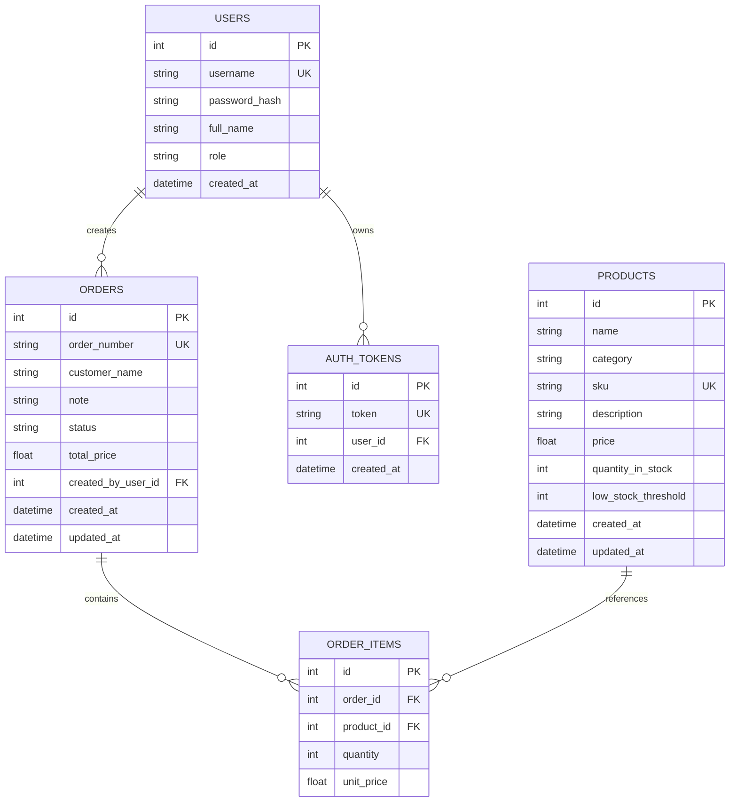

# Databázová dokumentace - moderní varianta

Tento dokument popisuje databázový návrh moderní varianty skladového systému postavené na FastAPI a Reactu.

## Použitá databáze

Aplikace používá relační databázi `SQLite` přes `SQLAlchemy ORM`.

Výhody pro školní projekt:

- jednoduché spuštění,
- není potřeba databázový server,
- stále jde o relační model s vazbami a integritními omezeními.

## Přehled tabulek

### `users`

Ukládá uživatele aplikace.

| Sloupec | Typ | Význam |
|---|---|---|
| `id` | `INTEGER` | Primární klíč |
| `username` | `VARCHAR` | Přihlašovací jméno, unikátní |
| `password_hash` | `VARCHAR` | Hash hesla |
| `full_name` | `VARCHAR` | Celé jméno |
| `role` | `VARCHAR` | Role `admin` nebo `worker` |
| `created_at` | `DATETIME` | Čas vytvoření |

### `products`

Ukládá skladové produkty.

| Sloupec | Typ | Význam |
|---|---|---|
| `id` | `INTEGER` | Primární klíč |
| `name` | `VARCHAR` | Název produktu |
| `category` | `VARCHAR` | Kategorie |
| `sku` | `VARCHAR` | Jedinečný skladový kód |
| `description` | `TEXT` | Popis produktu |
| `price` | `FLOAT` | Cena za kus |
| `quantity_in_stock` | `INTEGER` | Aktuální zásoba |
| `low_stock_threshold` | `INTEGER` | Hraniční hodnota pro upozornění |
| `created_at` | `DATETIME` | Čas vytvoření |
| `updated_at` | `DATETIME` | Čas poslední změny |

### `orders`

Ukládá hlavičky objednávek.

| Sloupec | Typ | Význam |
|---|---|---|
| `id` | `INTEGER` | Primární klíč |
| `order_number` | `VARCHAR` | Jedinečné číslo objednávky |
| `customer_name` | `VARCHAR` | Jméno zákazníka |
| `note` | `TEXT` | Poznámka |
| `status` | `VARCHAR` | Stav objednávky |
| `total_price` | `FLOAT` | Celková cena objednávky |
| `created_by_user_id` | `INTEGER` | Uživatel, který objednávku vytvořil |
| `created_at` | `DATETIME` | Čas vytvoření |
| `updated_at` | `DATETIME` | Čas poslední změny |

### `order_items`

Ukládá jednotlivé položky objednávky.

| Sloupec | Typ | Význam |
|---|---|---|
| `id` | `INTEGER` | Primární klíč |
| `order_id` | `INTEGER` | Cizí klíč do `orders` |
| `product_id` | `INTEGER` | Cizí klíč do `products` |
| `quantity` | `INTEGER` | Počet kusů |
| `unit_price` | `FLOAT` | Jednotková cena v době objednávky |

### `auth_tokens`

Ukládá přihlašovací tokeny.

| Sloupec | Typ | Význam |
|---|---|---|
| `id` | `INTEGER` | Primární klíč |
| `token` | `VARCHAR` | Autorizační token |
| `user_id` | `INTEGER` | Vazba na uživatele |
| `created_at` | `DATETIME` | Čas vytvoření tokenu |

## Vazby mezi tabulkami

- `users (1) -> (N) orders`
- `users (1) -> (N) auth_tokens`
- `orders (1) -> (N) order_items`
- `products (1) -> (N) order_items`

Z toho plyne:

- mezi `orders` a `products` existuje vztah `M:N`,
- tento vztah je realizovaný přes `order_items`.

## ER diagram

## Integritní pravidla

- `users.username` je unikátní.
- `products.sku` je unikátní.
- `orders.order_number` je unikátní.
- `auth_tokens.token` je unikátní.
- `order_items` odkazují na existující objednávku i produkt.

## Jak databáze podporuje funkční požadavky

### Správa produktů

Tabulka `products` ukládá:

- identifikaci produktu,
- cenu,
- skladovou zásobu,
- a low-stock limit.

### Správa objednávek

Tabulky `orders` a `order_items` umožňují:

- vytvářet objednávky,
- přidávat do objednávky více položek,
- sledovat stav objednávky,
- uchovat cenu z doby vytvoření objednávky.

### Role uživatelů

Tabulka `users` obsahuje sloupec `role`, který backend využívá pro autorizaci.

### API autentizace

Tabulka `auth_tokens` umožňuje držet přihlášení přes token.

## Poznámka k normalizaci

Datový model je rozumně normalizovaný:

- uživatelé jsou odděleni od objednávek,
- produkty jsou oddělené od položek objednávek,
- položky objednávek neobsahují duplicitní text produktu, jen vazbu na produkt a snapshot ceny.

To snižuje redundanci a zlepšuje konzistenci dat.

